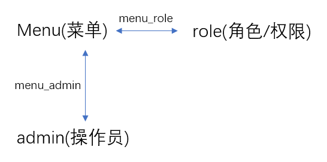
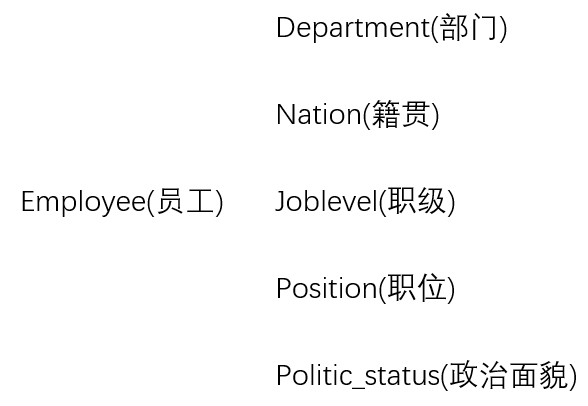

办公系统

## 一、认证操作

### 1.登录

1.功能实现过程

~~~markdown
1.自定义登录Controller
	"/login"

2.SpringSecurity 配置放行登录url

3.登录前获取验证码
	"/captcha"		【使用：--->google captcha依赖--->CaptchaConfig进行基本配置】

4.登录
(1)检查验证码
(2)检查用户名，密码		(UserDetailsService)
(3)检查通过:
	生成Token,返回前端
	将UserDetails(Admin)对象包装成Authentication对象，存储到SpringSecurity全局上下文中

5.登录后获取用户信息
	"/admin/info"
	直接从SpringSecurity全局上下文中获取即可
~~~

2.关键代码

~~~java
//1.UserDetailsService
public class UserDetailsServiceImpl implements UserDetailsService {
    @Autowired
    private AdminService adminService;
    @Override
    public UserDetails loadUserByUsername(String username) throws UsernameNotFoundException {
        //AdminService
        Admin admin = adminService.getAdminWithRolesByUsername(username);
        return admin;
    }
}

//2.UserDetails
public class Admin implements Serializable, UserDetails {
    @Overrride
}
~~~

~~~java
//3.SpringSecurity 使用自定义UserDetailsService
public class SecurityConfig extends WebSecurityConfigurerAdapter {
    
    //==========自定义UserDetailsService========
    @Autowired
    private UserDetailsService userDetailsService;
    @Override
    protected UserDetailsService userDetailsService() {
        return userDetailsService;
    }
    @Override
    protected void configure(AuthenticationManagerBuilder auth) throws Exception {
        auth.userDetailsService(userDetailsService).passwordEncoder(passwordEncoder());
    }
    @Bean
    public PasswordEncoder passwordEncoder(){
        return new BCryptPasswordEncoder();
    }//密码比较方式
    //==========================================
    
    //其他自定义内容
    @Override
    protected void configure(HttpSecurity http) throws Exception {

        http.csrf().disable()
                .authorizeRequests()
                .antMatchers("/login").permitAll()//配置放行login
                .anyRequest().authenticated()
    }
}
~~~

### 2.JWT登录过滤器

1.基础逻辑（TIP：过滤器的基础逻辑就是**放行**，重要的是在放行之前做什么操作）

~~~markdown
1.获取请求头，检查是否携带token
1.1 没有。--->直接放行。由接下来SpringSecurity的其他过滤器完成相应的控制。
1.2 有。

2.检查token是否合法且有效
2.1 NO。--->直接放行。由接下来SpringSecurity的其他过滤器完成相应的控制。
2.2 YES。

3.将用户信息，生成Authentication对象，存入SpringSecurity上下文中
--->并放行

//TODO:
留一个问题等待解决：为什么经过login逻辑之后，springsecurity上下文中的authentication仍为空

4.SpringSecurity 配置JWT登录过滤器
~~~

2.关键代码

~~~java
//自定义JWT登录过滤器
public class JwtAuthenticationTokenFilter extends OncePerRequestFilter {
    @Override
    protected void doFilterInternal(HttpServletRequest request, HttpServletResponse response, FilterChain filterChain) throws ServletException, IOException {
        //代码...
        filterChain.doFilter(request,response);
    }
}
~~~

~~~java
//SpringSecurity 配置
public class SecurityConfig extends WebSecurityConfigurerAdapter {
    @Override
    protected void configure(HttpSecurity http) throws Exception {
		//使用JWT，不需要使用session
        http.sessionManagement()
                .sessionCreationPolicy(SessionCreationPolicy.STATELESS);

        //JWT登陆过滤器 设置在 UsernamePasswordAuthenticationFilter前面
        http.addFilterBefore(jwtAuthenticationTokenFilter(), UsernamePasswordAuthenticationFilter.class);
    }
}
~~~

## 二、统一权限控制

~~~markdown
数据库中三张表，表述了访问的url和所需角色的对应关系：
t_menu(url) --- t_menu_role(mid,rid) --- t_role
~~~

1.基本逻辑：

~~~markdown
1.获取请求的url，根据url设置访问这个url所需的角色

2.获取当前用户的角色，比较(所需角色<->用户的角色)，决定能否访问

3.SpringSecurity 配置
~~~

2.关键代码

~~~java
//1.获取请求的url，根据url设置访问这个url所需的角色
@Component
public class MyFilter implements FilterInvocationSecurityMetadataSource {
    @Autowired
    private MenuService menuService;
    AntPathMatcher antPathMatcher = new AntPathMatcher();
    
    @Override
    public Collection<ConfigAttribute> getAttributes(Object o) throws IllegalArgumentException {
        //获取请求的url
        String requestUrl = ((FilterInvocation) o).getRequestUrl();
        List<Menu> menusWithRoles = menuService.getMenusWithRoles();
        for (Menu menu :
                menusWithRoles) {
            if (antPathMatcher.match(requestUrl,menu.getUrl())){
                //能匹配上，则设置角色
                String[] roles
                        = menu.getRoles().stream().map(Role::getName).toArray(String[]::new);
                return SecurityConfig.createList(roles);
            }
        }
        //匹配不上，设置默认角色ROLE_LOGIN(只要登录就能访问)
        return SecurityConfig.createList("ROLE_LOGIN");
    }

    @Override
    public Collection<ConfigAttribute> getAllConfigAttributes() {
        return null;
    }

    @Override
    public boolean supports(Class<?> aClass) {
        return false;
    }
}
~~~

~~~java
//2.获取当前用户的角色，比较(所需角色<->用户的角色)，决定能否访问
@Component
public class MyUrlDecisionManager implements AccessDecisionManager {
    @Override
    public void decide(Authentication authentication, Object o, Collection<ConfigAttribute> collection) throws AccessDeniedException, InsufficientAuthenticationException {

        for (ConfigAttribute configAttribute : collection) {
            //获取访问这个url，所需角色
            String needRole = configAttribute.getAttribute();
            //（1）首先判断"ROLE_LOGIN"这个角色
            if("ROLE_LOGIN".equals(needRole)){
                //判断是否登录
                if (authentication instanceof AnonymousAuthenticationToken) {	//这是判断是否登录的一种方法
                    throw new AccessDeniedException("CustomUrlDecisionManager : 尚未登录,请登录！");
                } else {
                    return;//表示已登录，直接return
                }
            }
			
            //（2）获取当前用户具有的角色，比较(所需角色<->用户的角色)
            Collection<? extends GrantedAuthority> authorities = authentication.getAuthorities();
            for (GrantedAuthority authority :
                    authorities) {
                if (authority.getAuthority().equals(needRole)) {
                    return;//匹配上，表示能访问，直接return
                }
            }
        }
        throw new AccessDeniedException("CustomUrlDecisionManager : 权限不足，请联系管理员！");
    }

    @Override
    public boolean supports(ConfigAttribute configAttribute) {
        return false;
    }

    @Override
    public boolean supports(Class<?> aClass) {
        return false;
    }
}

~~~

~~~java
//3.SpringSecurity 配置
@Configuration
public class SecurityConfig extends WebSecurityConfigurerAdapter {
    
    @Override
    protected void configure(HttpSecurity http) throws Exception {

        http.csrf().disable()
                .authorizeRequests()
                .antMatchers("/login").permitAll()
                .anyRequest().authenticated()
                //动态权限配置(自定义的)
                .withObjectPostProcessor(new ObjectPostProcessor<FilterSecurityInterceptor>() {
                    @Override
                    public <O extends FilterSecurityInterceptor> O postProcess(O o) {
                        o.setSecurityMetadataSource(myFilter);
                        o.setAccessDecisionManager(myUrlDecisionManager);
                        return o;
                    }
                }) ;
    }
    
}
~~~

## 三、自定义 认证失败处理器 和 授权（权限）失败控制器

1.基本概念

~~~markdown
1.SpringSecurity 包括 认证控制和权限控制
	默认的认证失败处理：
	默认的权限失败处理：

2.SpringSecurity 配置
~~~

2.关键代码

~~~java
//认证失败处理器
@Component
public class RestAuthenticationEntryPoint implements AuthenticationEntryPoint {

    @Override
    public void commence(HttpServletRequest request, HttpServletResponse response, AuthenticationException authException) throws IOException, ServletException {
        response.setCharacterEncoding("UTF-8");
        response.setContentType("application/json");
        PrintWriter out = response.getWriter();
        RespBean bean = RespBean.error("尚未登录，请登录后访问！");
        bean.setCode(HttpServletResponse.SC_UNAUTHORIZED);//401
        out.write(new ObjectMapper().writeValueAsString(bean));
        out.flush();
        out.close();
    }
}
~~~

~~~java
//授权（权限）失败控制器
@Component
public class RestfulAccessDeniedHandler implements AccessDeniedHandler {

    @Override
    public void handle(HttpServletRequest request, HttpServletResponse response, AccessDeniedException e) throws IOException, ServletException {
        response.setCharacterEncoding("UTF-8");
        response.setContentType("application/json");
        PrintWriter out = response.getWriter();
        RespBean bean = RespBean.error("权限不足，请联系管理员！");
        bean.setCode(HttpServletResponse.SC_FORBIDDEN);//403
        out.write(new ObjectMapper().writeValueAsString(bean));
        out.flush();
        out.close();
    }
}
~~~

~~~java
// SpringSecurity 配置
@Configuration
public class SecurityConfig extends WebSecurityConfigurerAdapter {
    
    @Override
    protected void configure(HttpSecurity http) throws Exception {
        
        http.exceptionHandling()
                .authenticationEntryPoint(restAuthenticationEntryPoint)//认证失败处理器
                .accessDeniedHandler(restfulAccessDeniedHandler);//授权失败处理器
    
}
~~~

## 四、业务功能

### 1.menu-role-admin

#### 1.Admin管理：

~~~markdown
url：/system/cfg
controller：AdminController

1.获取所有admin（包括对应的role）
2.修改admin信息
3.删除admin
4.修改admin对应的role（包括增删改）
	@PutMapping("/role")
    public RespBean updateAdminRoles(Integer mid,Integer[] rids){
        return adminService.updateAdminRoles(mid, rids);
    }
~~~

#### 2.个人中心（已登录admin的操作）

~~~markdown
url：/
controller：AdminInfoController

1.更新自己的信息（不涉及密码）
	TIP：更新完自身信息，需要更新Authentication信息
2.更新密码
~~~

#### 3.菜单menu管理

~~~markdown
url： /system/cfg
controller：MenuController

1.根据用户id获取可操作的菜单列表

============================================

url： /system/basic --- /permission
controller：MenuController

1.查询所有菜单（包括子菜单）
2.根据角色id，获取对应的菜单id
3.根据角色id，更新该角色的菜单（包括增删改）
~~~

#### 4.角色role管理

~~~markdown
url： /system/basic --- /role
controller:RoleController

1.获取所有角色
2.添加角色
3.删除角色
~~~

### 2.employee及关联表

1.employee管理

~~~markdown
url： /employee/basic
controller:EmployeeController

1.分页[+搜索条件]查询员工列表
2.获取所有和employee相关的表的内容
	获取所有政治面貌
	获取所有职称
	获取所有民族
	获取所有职位
	获取所有部门

3.添加员工
4.更新员工
5.删除员工
**6.导出员工信息**	easypoi依赖--->流的方式
~~~

2.department管理

~~~markdown
url： /system/basic --- /department
controller:DepartmentController

1.获取所有部门
2.添加部门
3.删除部门
~~~

3.joblevel管理

~~~markdown
url： /system/basic --- /joblevel
controller:JobLevelController

1.获取所有职称
2.添加职称
3.更新职称
4.删除职称
5.批量删除职称
~~~

4.position管理

~~~markdown
url： /system/basic --- /pos
controller:PositionController

1.获取所有职位
2.增加职位
3.更新职位信息
4.删除职位信息
5.批量删除职位信息
~~~

## 五、（Springmvc）统一异常处理

~~~java
/**
 * 全局异常处理类
 */
@RestControllerAdvice
public class GlobalExceptionHandler {

    /**
     * 捕捉 IOException
     */
    @ExceptionHandler(IOException.class)
    public RespBean iOException(IOException e) {
        return RespBean.error("IO异常");
    }

    /**
     * SQLException 数据库异常
     */
    @ExceptionHandler(SQLException.class)
    public RespBean sqlException(SQLException e) {
        if (e instanceof SQLIntegrityConstraintViolationException) {
            return RespBean.error("该数据存在关联数据，操作失败！");
        }
        return RespBean.error("数据库异常，操作失败！");
    }

    /**
     * 其他异常处理
     * ...
     */
}
~~~

## 六、项目总结

### 1.可以改进的地方

（1）登录后生成token，可以使用redis进行存储；

（...）

### 2.收获

（1）SpringSecurity的基本使用：包括认证处理和权限处理

（2）sql的编写

~~~markdown
关于mybatisplus中动态sql的编写：
	1.<sql id=""> + <include refid=""> ===> 可以完成sql的服用
	2.resultMap collection/association
	3.多级查询的迭代写法
	4.储存过程 解决 一个需求需要使用多个sql才能完成的需求
~~~

~~~xml
<resultMap id="DepartmentWithChildren" type="Department" extends="BaseResultMap">
        <collection property="children" ofType="Department"
                    select="com.zxf.server.mapper.DepartmentMapper.getAllDepartment"
                    column="id"/>
</resultMap>

<sql id="Base_Column_List">
        id, name, parentId, depPath, enabled, isParent
</sql>
    
<!-- 
	获取所有部门
     TIP:部门有多级结构，这里使用递归
-->
<select id="getAllDepartment" resultMap="DepartmentWithChildren">
        select
        <include refid="Base_Column_List"/>
        from t_department
        where parentId=#{parentId}
</select>
~~~

